# CN - Assignment 2

## Task-1: Comparison of congestion control protocols

<div align = "center">
    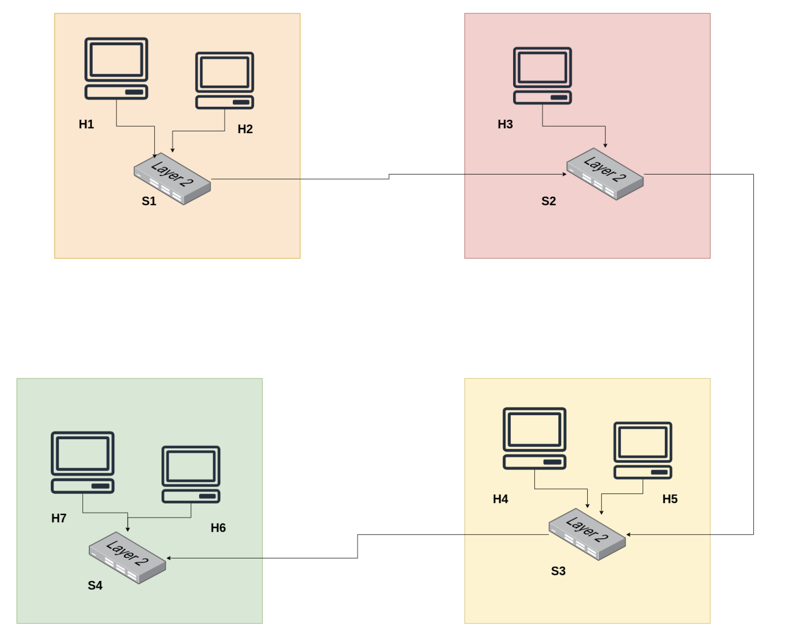
</div>

### Usage

#### Traffic Generation with Congestion Control Algorithms

Use `congestion_ctrl.py` to run the TCP experiments. The script accepts the following arguments:

- `<option>`: Experiment option (e.g., `a`, `b`, `c1`, `c2a`, `c2b`, `c2c`)
- `<cc_scheme>`: TCP congestion control scheme (e.g., `reno`, `cubic`, `bbr`)
- `[loss]`: (Optional) Packet loss percentage on the bottleneck link (default is 0)

(Run the given commands in the `CongestionComp` folder)

```bash
cd ./CongestionComp
```

**Example commands:**

For Part (a/b):

```bash
sudo python3 congestion_ctrl.py a/b <cong_algo>
```

For Part (c):

```bash
sudo python3 congestion_ctrl.py c1/c2a/c2b/c2c <cong_algo>
```

For Part (d):

```bash
sudo python3 congestion_ctrl.py c1/c2a/c2b/c2c <cong_algo> <loss>
```

_Note:_ Follow on-screen prompts (eg. to open wireshark for capturing) when running the experiments.

#### Analysis

Use `analysis.py` to process and analyze your PCAP (if captured using wireshark):
Add the path of your captured file in the code `analysis.py` as shown below:

```python
congestion_schemes = ['cubic', 'some_other_algo']
pcap_files = [
    '../PCAPs/Task1/a_cubic_sample.pcap',
    'some/other/file/path.pcap'
]
```

After adding the path just run

```bash
python3 analysis.py
```

This script parses the PCAP file, computes metrics (throughput, goodput, packet loss rate, maximum window size), and generates corresponding graphs.

## TCP Cubic

<div align = "center">
    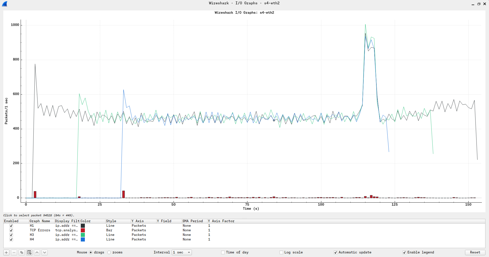
</div>

## TCP Westwood

<div align = "center">
    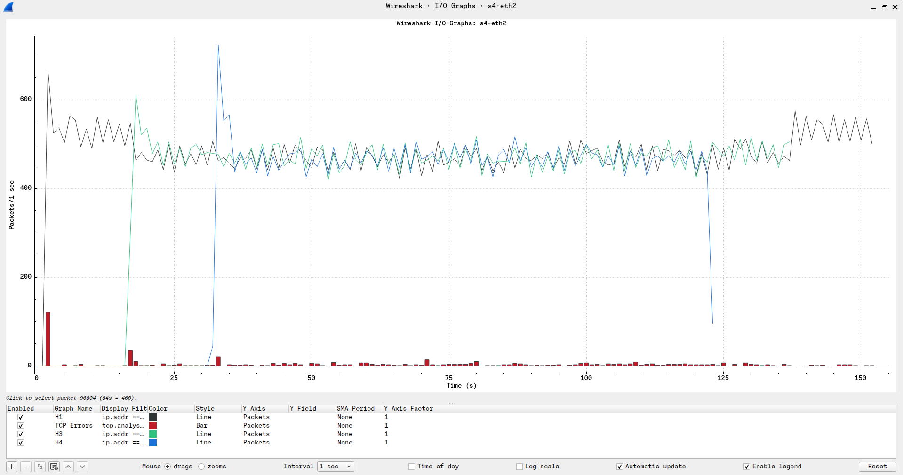
</div>

## TCP Scalable

<div align = "center">
    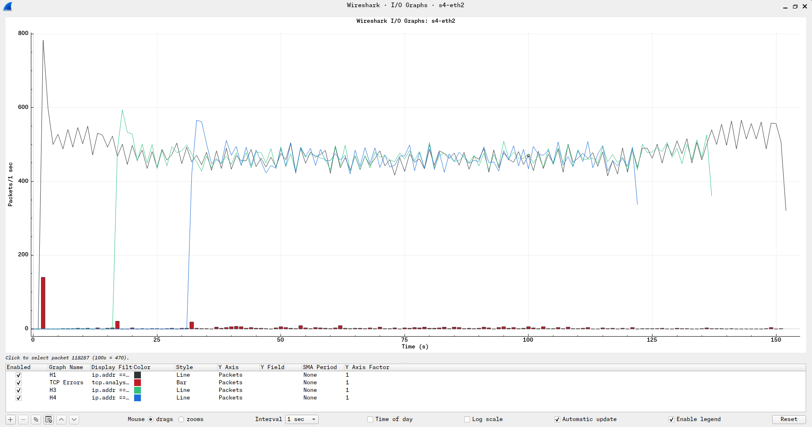
</div>

## Task-2 : Implementation and mitigation of SYN flood attack

<div align = "center">
    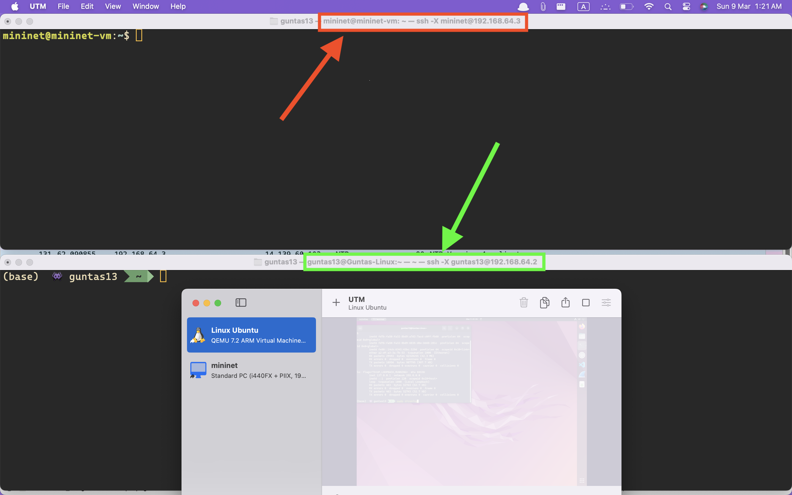
</div>

<div align = "center">
    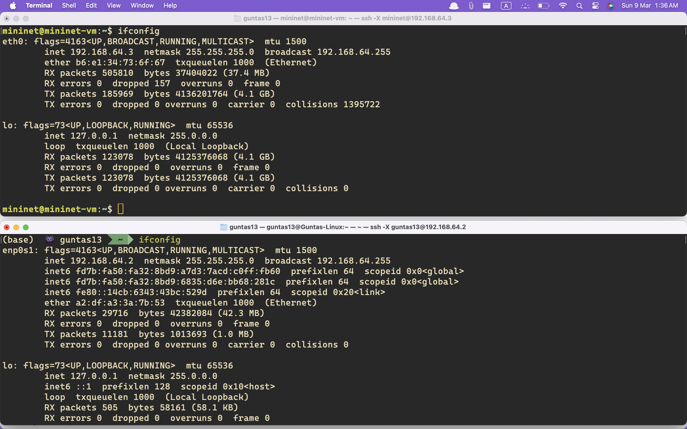
</div>

We used two VMs for peforming this task. On one VM we ran the `server` and on the other VM we ran our script for `legitimate traffic` and the `syn flood attack`.

```bash
cd ./SYNFlood/cpp
```

### SYN Flood Attack

**For Server** 192.168.64.3:8080 (in our case)

```bash
sudo sysctl -w net.ipv4.tcp_max_syn_backlog=4096
sudo sysctl -w net.ipv4.tcp_syncookies=0
sudo sysctl -w net.ipv4.tcp_synack_retries=1
```

```bash
g++ -std=c++17 simpleServer.cpp -o server
./server
```

**For Client** 192.168.64.2 (in our case)

```bash
cd ./SYNFlood/cpp/flood
```

```bash
chmod +x run_attack.sh
```

```bash
sudo ./run_attack.sh
```

<div align = "center">
    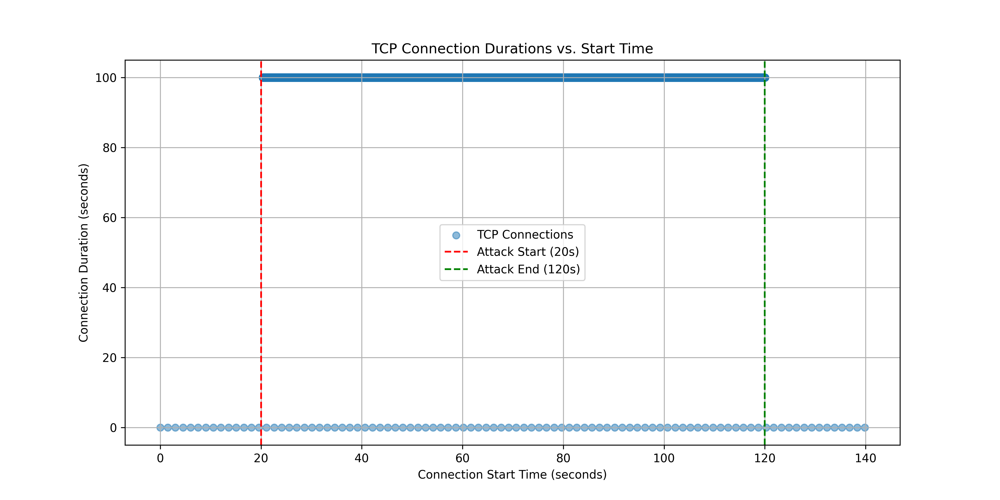
</div>

### SYN Flood Attack Mitigation

Set the usage of cookies for TCP to `1` for mitigating the syn flood attack as the server will only allocate memory for the clients which `ACK` the `SYN-ACK` from the server and won't open a half connection.

```bash
sudo sysctl -w net.ipv4.tcp_syncookies=1
```

Again run the process same as above.

<div align = "center">
    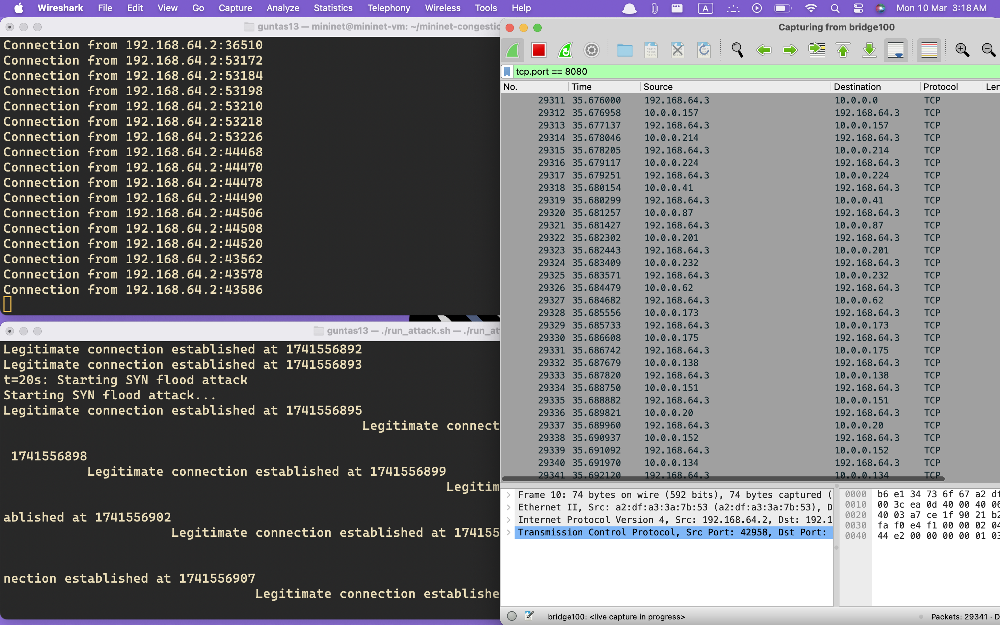
</div>

<div align = "center">
    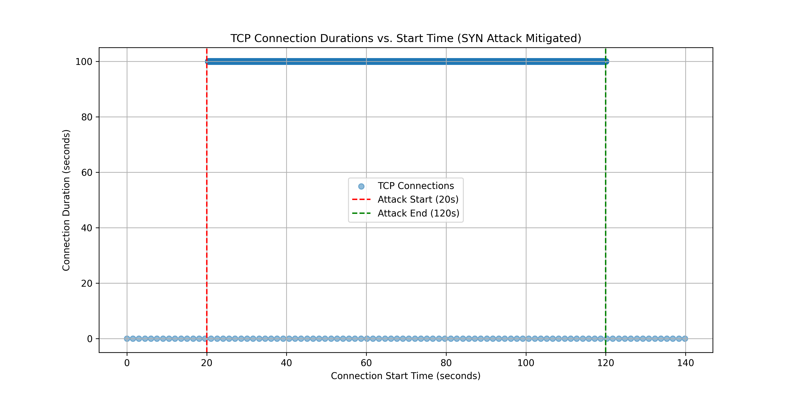
</div>

## Task-3 : TCP Behaviour under Nagle's Algorithm and DelayedACK

### Usage

```bash
cd ./NagleAlgo/cpp
```

**For Server** Run the `server.cpp` file in the folder `NagleAlgo/cpp`:

```bash
g++ -std=c++17 server.cpp -o server
./server <nagle_enabled: 0/1> <delayed_ack_enabled: 0/1>
```

**For Client** Run the `client.cpp` file in the same folder

```bash
g++ -std=c++17 client.cpp -o client
./client <nagle_enabled: 0/1> <delayed_ack_enabled: 0/1>
```

## Nagle's Algorithm On, Delayed ACK On

<div align = "center">
    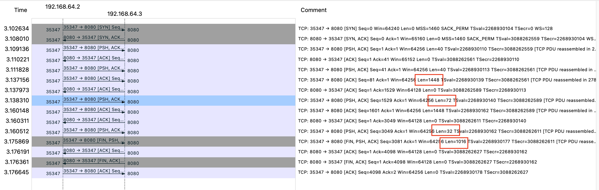
</div>

## Nagle's Algorithm On, Delayed ACK Off

<div align = "center">
    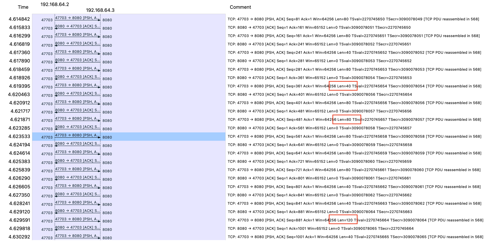
</div>

## Nagle's Algorithm Off, Delayed ACK On

<div align = "center">
    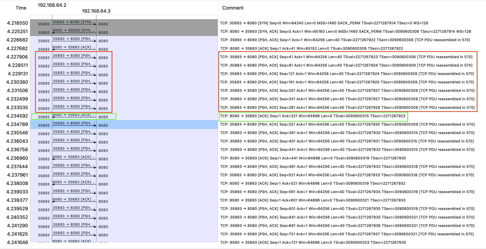
</div>

## Nagle's Algorithm Off, Delayed ACK Off

<div align = "center">
    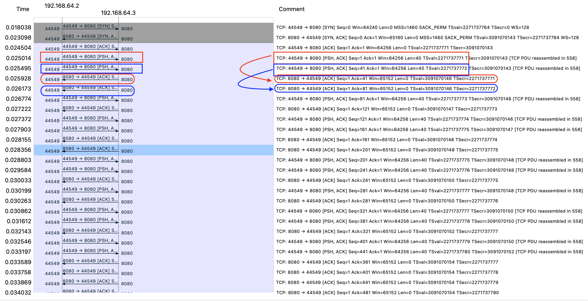
</div>

## Final Comparion

<div align = "center">
    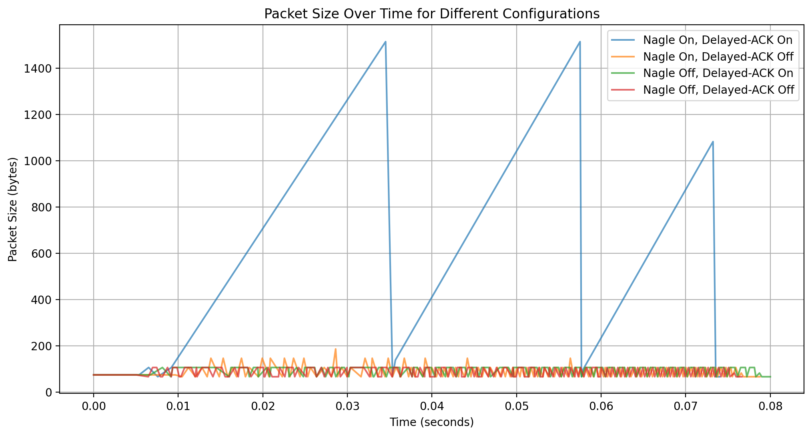
</div>
