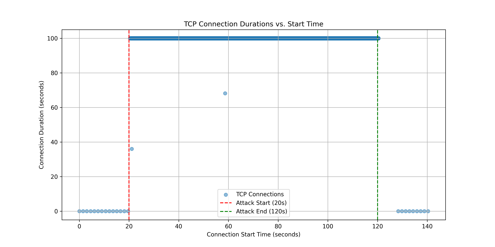

# Task-1: Comparison of congestion control protocols

    

## TCP Cubic

    

## TCP Westwood

    

## TCP Scalable

    

# Task-2 : Implementation and mitigation of SYN flood attack

    

    

## SYN Flood Attack

    

## SYN Flood Attack Mitigation

    

    

